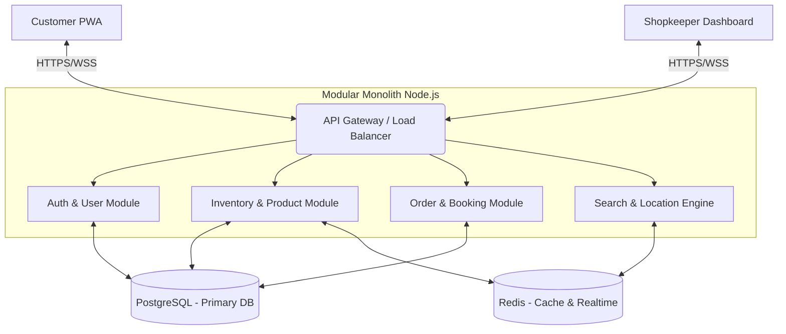

# Real-Time Hyperlocal Retail Inventory & Booking PWA

> [!NOTE]
> This document outlines the system architecture, database schema, API design, and core workflows for the requested hyperlocal retail inventory and booking platform.

## 1. Architecture Overview

We will use a **Modular Monolith** architecture to begin with, which guarantees fast development while maintaining boundaries for an eventual microservices split as the user base grows.

### Architecture Diagram

### Tech Stack
- **Frontend App & Dashboard**: React + Vite + TailwindCSS (for PWA capabilities)
- **Backend API**: Node.js with NestJS or Express (TypeScript recommended)
- **Primary Database**: PostgreSQL (ACID compliance for order locking and transactions)
- **Real-time & Caching**: Redis (Inventory caching, Geo-spatial search, WebSocket Pub/Sub)
- **Maps/Location**: Google Maps API (Distance Matrix API, Maps JavaScript API)

---

## 2. Core Functional Modules

### 2.1 Inventory Engine
- **Workflow**: Shop keeper updates stock -> DB row updated -> Redis cache invalidated -> WebSocket event published -> Customer App UI updates instantly without reloading.
- **Conflict Handling**: Optimistic Locking in PostgreSQL (using version col) or pessimistic row locks (`SELECT ... FOR UPDATE`) during checkout.

### 2.2 Price Comparison & Search
- **Workflow**: Products (SKUs) are normalized via predefined global categories. Upon user search, the system queries Redis for Geo-proximity (within X radius), fetches current active prices, and sorts them by a combination of distance and price.

### 2.3 Booking & Slot Scheduling
- **Workflow**: Operating hours are broken into 30/60 minute slots. Redis maintains an atomic counter for each shop's slot capacity limit. 

### 2.4 Demand Forecasting
- **Workflow**: Background workers run weekly to aggregate historical order data per SKU. A simple moving average or Exponential Smoothing curve can be generated for shopkeepers to visualize upcoming demand.

---

## 3. Database Design

```sql
-- PostgreSQL Core Schema Skeleton

-- Users & Roles
CREATE TABLE users (
    id UUID PRIMARY KEY,
    name VARCHAR(255),
    phone VARCHAR(20) UNIQUE,
    role VARCHAR(50), -- CUSTOMER, SHOPKEEPER
    created_at TIMESTAMP DEFAULT CURRENT_TIMESTAMP
);

CREATE TABLE shops (
    id UUID PRIMARY KEY,
    owner_id UUID REFERENCES users(id),
    name VARCHAR(255),
    lat DECIMAL(10, 8),
    lng DECIMAL(11, 8),
    address TEXT,
    active BOOLEAN DEFAULT TRUE
);

-- Catalog & Inventory
CREATE TABLE products ( -- Global product catalog (SKUs)
    sku VARCHAR(100) PRIMARY KEY,
    name VARCHAR(255),
    category VARCHAR(100)
);

CREATE TABLE shop_inventory (
    id UUID PRIMARY KEY,
    shop_id UUID REFERENCES shops(id),
    sku VARCHAR(100) REFERENCES products(sku),
    price DECIMAL(10, 2),
    stock_quantity INT,
    version INT DEFAULT 1, -- For optimistic locking
    UNIQUE(shop_id, sku)
);

-- Ordering & Booking
CREATE TABLE orders (
    id UUID PRIMARY KEY,
    customer_id UUID REFERENCES users(id),
    shop_id UUID REFERENCES shops(id),
    total_amount DECIMAL(10, 2),
    status VARCHAR(50), -- PENDING, CONFIRMED, READY, PICKED_UP
    pickup_time TIMESTAMP
);

CREATE TABLE order_items (
    id UUID PRIMARY KEY,
    order_id UUID REFERENCES orders(id),
    sku VARCHAR(100) REFERENCES products(sku),
    quantity INT,
    price_at_booking DECIMAL(10, 2)
);
```

---

## 4. API Design

### REST API Examples

#### 1. Search Nearby Inventory
**GET** `/api/v1/search?lat=12.971&lng=77.594&radius=5&q=Milk`
**Response:**
```json
{
  "results": [
    {
      "shop": {"id": "s1", "name": "Fresh Mart", "distance": "1.2km"},
      "product": {"sku": "MILK-500", "name": "Organic Milk 500ml"},
      "price": 30.00,
      "stock": 15
    }
  ]
}
```

#### 2. Create Order & Book Slot
**POST** `/api/v1/orders`
**Request:**
```json
{
  "shopId": "s1",
  "items": [{"sku": "MILK-500", "quantity": 2}],
  "pickupSlot": "2023-11-20T10:00:00Z"
}
```

---

## 5. UI/UX Wireframe Guidelines

### Mobile-first Customer PWA
- **Home**: Geo-location auto-detected at the top. Prominent search bar. "Trending near you" product carousels.
- **Product Search View**: Split map/list view. The list highlights prices across stores (e.g., "Best Price: 200m away").
- **Cart/Checkout**: Time slot picker in horizontal scroll. Clean summary of order total and maps navigation button upon confirmation.

### Shopkeeper Dashboard
- **Live Queue**: Kanban-style board for orders (Pending -> Packing -> Ready for Pickup).
- **Inventory Mgt**: Simple table with rapid + / - ticker for manual stock sync.
- **Analytics**: Charts showing historical sales vs. forecasted demand per SKU.

---

## 6. Sample Code Snippets

### A. Real-time Inventory Update (WebSockets)
```typescript
import { WebSocketGateway, WebSocketServer } from '@nestjs/websockets';
import { Server } from 'socket.io';

@WebSocketGateway({ cors: true })
export class InventoryGateway {
  @WebSocketServer() server: Server;

  broadcastStockUpdate(shopId: string, sku: string, newStock: number) {
    // Notify connected customers watching this shop's inventory
    this.server.to(`shop-${shopId}`).emit('stockUpdate', {
      sku,
      newStock,
      timestamp: new Date().toISOString()
    });
  }
}
```

### B. Booking Transaction & Locking (Node.js/TypeORM)
```typescript
async createOrder(orderDto: CreateOrderDto) {
  // Use transaction to ensure ACID compliance
  return this.dataSource.transaction(async manager => {
    for (const item of orderDto.items) {
      // Pessimistic Write Lock prevents concurrency issues (flash sales)
      const inventory = await manager
        .createQueryBuilder(ShopInventory, 'inv')
        .setLock('pessimistic_write')
        .where('inv.shopId = :shop AND inv.sku = :sku', { shop: orderDto.shopId, sku: item.sku })
        .getOne();

      if (!inventory || inventory.stockQuantity < item.quantity) {
        throw new Error(`Insufficient stock for ${item.sku}`);
      }

      inventory.stockQuantity -= item.quantity;
      await manager.save(inventory);
    }
    
    const order = await manager.save(Order, new Order(orderDto));
    return order;
  });
}
```

### C. Slot Scheduling Decrement (Redis Lua Script)
```javascript
// Atomically checks if slot capacity exists and decrements it
const luaScript = `
  local currentCapacity = tonumber(redis.call('GET', KEYS[1]) or "0")
  if currentCapacity > 0 then
    redis.call('DECR', KEYS[1])
    return 1 -- Booking allowed
  else
    return 0 -- Slot full
  end
`;

// Run script from Node.js
const result = await redis.eval(luaScript, 1, `shop:${shopId}:slot:${slotTime}`);
if (result === 0) throw new Error("Slot capacity reached");
```

---

## 7. Folder Structure

```text
src/
├── main.ts
├── app.module.ts
├── modules/
│   ├── auth/                # JWT, Users, Shopkeepers
│   ├── inventory/           # Stock sync, WebSockets, Redis cache
│   ├── orders/              # Checkout, Transactions
│   ├── search/              # Location-based querying
│   └── analytics/           # Forecasting models & dash stats
├── common/
│   ├── filters/             # Error handling
│   └── interceptors/        
└── db/
    ├── migrations/
    └── schema/
```

---

## 8. Deployment Overview

1. **Dockerization**: Create Dockerfiles for Frontend and Backend. Use Docker Compose locally.
2. **Database Management**: Deploy Managed PostgreSQL (e.g. AWS RDS/Neon) and Managed Redis (AWS ElastiCache/Upstash).
3. **Application Hosting**: Containerized backend hosted on Google Cloud Run or AWS ECS for auto-scaling.
4. **PWA Hosting**: Deploy Frontend via Vercel or AWS CloudFront/S3 ensuring HTTPS (required for Service Workers & PWA installation).
5. **CI/CD**: Automate migrations and deployments using GitHub Actions.
